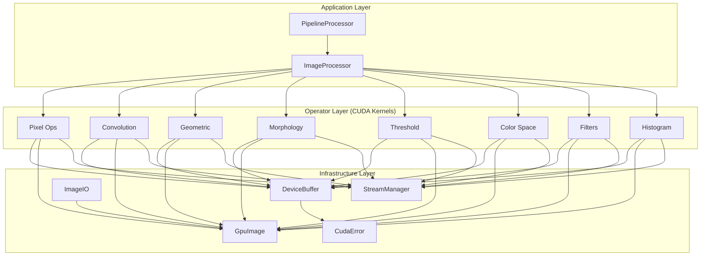
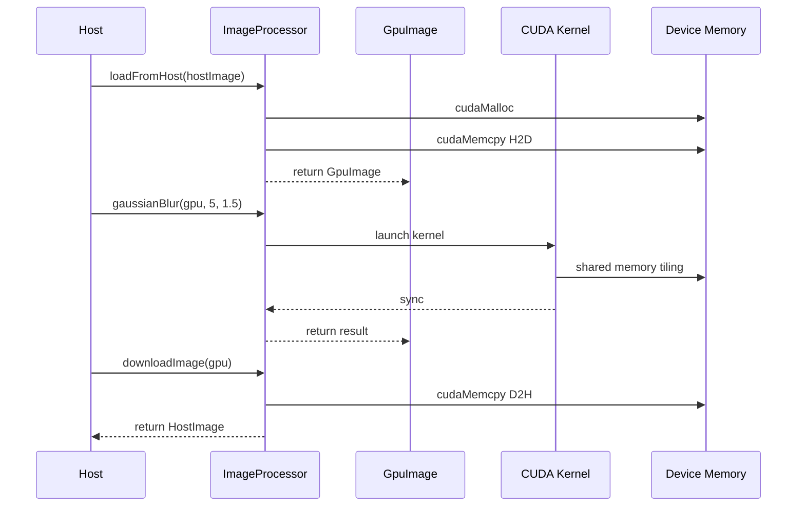
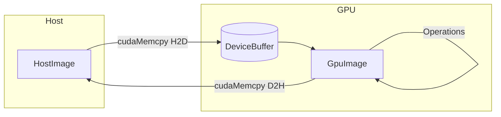

# Architecture Overview

Mini-OpenCV uses a **three-layer architecture** designed for performance, modularity, and ease of use.

## Three-Layer Design

## Layer Responsibilities

### 1. Application Layer

The top-level API that users interact with:

| Component | Purpose |
|-----------|---------|
| `ImageProcessor` | Main entry point for image operations |
| `PipelineProcessor` | Chain multiple operations with async execution |

### 2. Operator Layer

CUDA kernels implementing image processing algorithms:

| Category | Operations | CUDA Technique |
|----------|------------|----------------|
| **Pixel** | Invert, grayscale, brightness | Per-pixel parallelism |
| **Convolution** | Gaussian blur, Sobel, custom kernels | Shared memory tiling |
| **Histogram** | Calculation, equalization | Atomic operations + reduction |
| **Geometric** | Resize, rotate, flip, affine | Bilinear interpolation |
| **Morphology** | Erosion, dilation, open/close | Custom structuring elements |
| **Threshold** | Global, adaptive, Otsu | Histogram-driven |
| **Color Space** | RGB/HSV/YUV conversion | Matrix operations |
| **Filters** | Median, bilateral, sharpen | Edge-preserving filters |

### 3. Infrastructure Layer

Core utilities for GPU computing:

| Component | Purpose |
|-----------|---------|
| `DeviceBuffer` | RAII GPU memory management |
| `GpuImage` | Image container with GPU memory |
| `CudaError` | Error handling and checking |
| `ImageIO` | Image file I/O (JPEG, PNG, BMP) |
| `StreamManager` | CUDA stream pool for async execution |

## Data Flow

## Memory Model

### Zero-Copy Optimization

Key optimizations:

1. **Lazy Allocation**: Memory allocated on first use
2. **Buffer Reuse**: Memory pool for temporary buffers
3. **Async Transfer**: Overlap compute and transfer using CUDA streams

## CUDA Stream Pipeline

Multi-stream execution enables overlapping operations:

```mermaid
gantt
    title Multi-Stream Pipeline Execution
    dateFormat X
    axisFormat %s
    
    section Stream 0
    H2D Transfer 0    :0, 2
    Kernel 0          :2, 5
    D2H Transfer 0    :5, 7
    
    section Stream 1
    H2D Transfer 1    :1, 3
    Kernel 1          :3, 6
    D2H Transfer 1    :6, 8
    
    section Stream 2
    H2D Transfer 2    :2, 4
    Kernel 2          :4, 7
    D2H Transfer 2    :7, 9
```

## Supported GPU Architectures

| Architecture | Compute Capability | Example GPUs |
|--------------|-------------------|--------------|
| Turing | SM 75 | RTX 20 series, T4 |
| Ampere | SM 80/86 | A100, RTX 30 series |
| Ada Lovelace | SM 89 | RTX 40 series, L4 |
| Hopper | SM 90 | H100 |

## Next Steps

- [Memory Model](./memory-model) - Deep dive into GPU memory management
- [CUDA Streams](./cuda-streams) - Async execution details
- [Design Decisions](./design-decisions) - Architecture decision records
