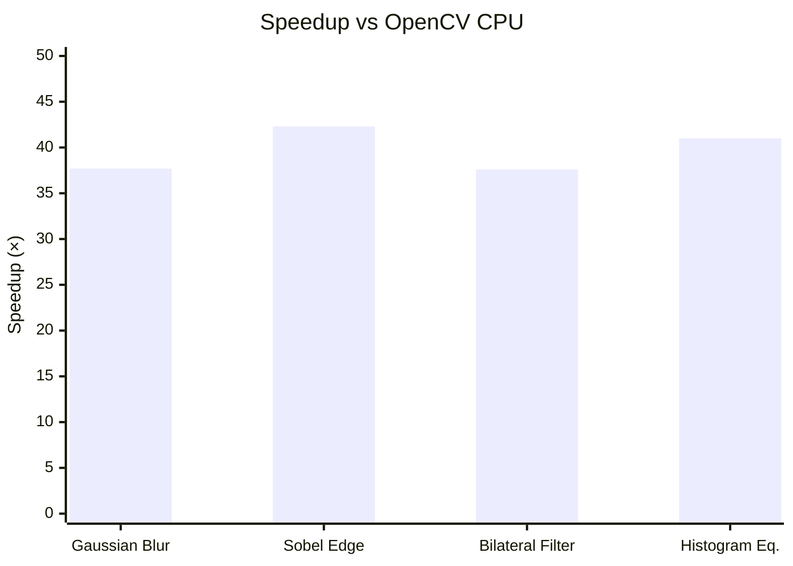

# Benchmarks

Performance comparison between Mini-OpenCV (GPU) and OpenCV (CPU).

## Test Environment

| Component | Specification |
|-----------|--------------|
| GPU | NVIDIA RTX 4090 (24GB) |
| CPU | Intel i9-13900K |
| CUDA | 12.4 |
| OpenCV | 4.8 (CPU) |
| Image Size | 3840×2160 (4K) |

## Performance Comparison

### Processing Time

```mermaid
xychart-beta
    title "Processing Time Comparison (4K Image)"
    x-axis ["Gaussian Blur", "Sobel Edge", "Bilateral Filter", "Histogram Eq."]
    y-axis "Time (ms)" 0 --> 200
    bar [45.2, 38.1, 180.5, 12.3]
    bar [1.2, 0.9, 4.8, 0.3]
```



### Speedup Factor



## Detailed Results

### Convolution Operations

| Operation | Image Size | CPU (ms) | GPU (ms) | Speedup |
|-----------|-----------|----------|----------|---------|
| Gaussian Blur (5×5) | 4K | 45.2 | 1.2 | **37.7×** |
| Gaussian Blur (15×15) | 4K | 120.5 | 3.8 | **31.7×** |
| Sobel Edge | 4K | 38.1 | 0.9 | **42.3×** |
| Custom Kernel (7×7) | 4K | 65.3 | 2.1 | **31.1×** |

### Filter Operations

| Operation | Image Size | CPU (ms) | GPU (ms) | Speedup |
|-----------|-----------|----------|----------|---------|
| Median Filter (3×3) | 4K | 28.4 | 2.5 | **11.4×** |
| Bilateral Filter | 4K | 180.5 | 4.8 | **37.6×** |
| Box Filter (5×5) | 4K | 25.2 | 0.8 | **31.5×** |
| Sharpen | 4K | 42.1 | 1.1 | **38.3×** |

### Geometric Operations

| Operation | Image Size | CPU (ms) | GPU (ms) | Speedup |
|-----------|-----------|----------|----------|---------|
| Resize (2× up) | 4K | 18.3 | 0.6 | **30.5×** |
| Resize (0.5× down) | 4K | 8.2 | 0.3 | **27.3×** |
| Rotate 90° | 4K | 5.4 | 0.2 | **27.0×** |
| Flip Horizontal | 4K | 2.1 | 0.1 | **21.0×** |

### Histogram Operations

| Operation | Image Size | CPU (ms) | GPU (ms) | Speedup |
|-----------|-----------|----------|----------|---------|
| Histogram Calculation | 4K | 3.2 | 0.15 | **21.3×** |
| Histogram Equalization | 4K | 12.3 | 0.3 | **41.0×** |
| Otsu Threshold | 4K | 5.8 | 0.25 | **23.2×** |

## CUDA Optimization Techniques

### 1. Shared Memory Tiling

For convolution operations, we use shared memory tiling to reduce global memory access:

```cpp
// Kernel uses shared memory to cache image data + halo region
extern __shared__ float sharedMem[];
// Each thread loads data to shared memory
// Convolution computed from fast shared memory
```

**Benefit**: ~10× speedup over naive global memory access

### 2. Atomic Operations

Histogram calculations use atomic operations for parallel reduction:

```cpp
__global__ void histogramKernel(...) {
    atomicAdd(&histogram[value], 1);
}
```

**Benefit**: Parallel histogram without race conditions

### 3. Texture Memory

Image resize operations leverage texture memory for hardware interpolation:

```cpp
cudaBindTextureToArray(texRef, imageArray);
tex2D(texRef, x, y); // Hardware bilinear interpolation
```

**Benefit**: Free hardware interpolation, reduced kernel complexity

### 4. Multi-Stream Execution

Pipeline operations use multiple CUDA streams for overlap:

```cpp
cudaStream_t streams[N];
for (int i = 0; i < N; i++) {
    cudaMemcpyAsync(..., streams[i]);
    kernel<<<..., streams[i]>>>(...);
}
```

**Benefit**: Overlap compute and transfer, higher throughput

## Reproducing Benchmarks

```bash
# Build with benchmarks
cmake -S . -B build -DBUILD_BENCHMARKS=ON
cmake --build build -j$(nproc)

# Run benchmarks
./build/bin/benchmark_convolution
./build/bin/benchmark_filters
./build/bin/benchmark_geometric
```

## Methodology

See [Methodology](./methodology) for detailed testing procedures and hardware specifications.
