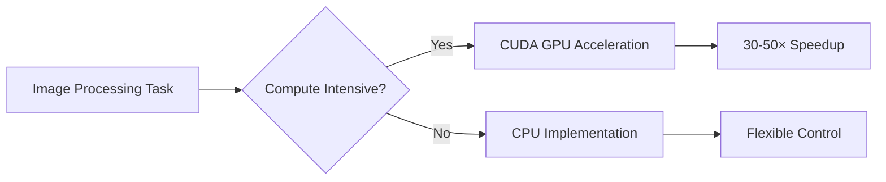
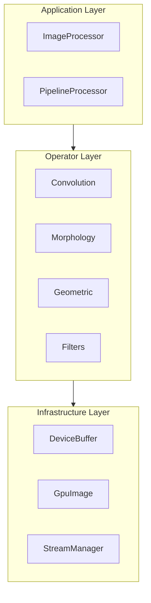

# Technical Whitepaper

This document provides a detailed overview of Mini-OpenCV's design philosophy, technology choices, and optimization strategies.

## Project Background

Mini-OpenCV is a CUDA high-performance image processing library designed to achieve **30-50× speedup** over CPU OpenCV implementations. The project's design goals:

1. **Extreme Performance** - Fully leverage GPU parallel computing capabilities
2. **Clean API** - Modern C++17 interface design
3. **Easy Integration** - Drop-in replacement for performance-critical code paths
4. **Comprehensive Testing** - Unit tests and performance benchmarks coverage

## Technology Stack

### Core Technologies

| Component | Version | Rationale |
|-----------|---------|-----------|
| C++ | 17 | Modern C++ features: structured bindings, std::optional, if constexpr |
| CUDA | 14+ | Latest CUDA features: cooperative groups, async memory operations |
| CMake | 3.18+ | Modern CMake: FetchContent, target-oriented build |
| GoogleTest | 1.14.0 | Industry-standard testing framework |
| Google Benchmark | 1.8.3 | Performance benchmarking |

### Why CUDA?

CUDA provides:
- **Massive Parallelism** - Thousands of threads executing simultaneously
- **Memory Hierarchy** - Global/Shared/Registers three-level memory
- **Specialized Hardware** - Tensor Cores, texture memory units

## Architecture Design

### Three-Layer Architecture

### Design Principles

1. **Separation of Concerns**
   - Application Layer: User API, workflow orchestration
   - Operator Layer: CUDA kernels, operator implementations
   - Infrastructure Layer: Memory management, error handling

2. **Zero-Overhead Abstraction**
   - Compile-time polymorphism (templates)
   - Inlined critical paths
   - Avoid virtual function calls

3. **Resource Management**
   - RAII memory management
   - Memory pool reuse
   - Pipeline async execution

## Performance Optimization Strategies

### CUDA Kernel Optimizations

| Technique | Description | Benefit |
|-----------|-------------|---------|
| Shared Memory Tiling | Data reuse, reduce global memory access | 2-4× speedup |
| Coalesced Access | Coalesced global memory access | 1.5-2× speedup |
| Warp Primitives | Use `__shfl`, `__reduce` | 1.2-1.5× speedup |
| Atomic Operations | Atomic counting, avoid synchronization | 1.1-1.3× speedup |
| Loop Unrolling | Unroll critical loops | 1.1-1.2× speedup |

### Memory Optimization

1. **Zero-Copy Optimization**
   - Use Pinned Memory
   - DMA direct transfer
   - Avoid intermediate buffers

2. **Memory Pool Reuse**
   - Pre-allocate large memory blocks
   - Reduce allocation overhead
   - Minimize fragmentation

### Asynchronous Execution

```mermaid
gantt
    title CUDA Streams Parallel Execution
    dateFormat X
    axisFormat %s
    
    section Stream 0
    Upload Image 1    :0, 1
    Gaussian Blur     :1, 2
    Download Result 1 :2, 3
    
    section Stream 1
    Upload Image 2    :0, 1
    Sobel Edge        :1, 2
    Download Result 2 :2, 3
```

## Comparison with Similar Projects

| Feature | Mini-OpenCV | OpenCV CUDA | cv-cuda | NPP |
|---------|:-----------:|:-----------:|:-------:|:---:|
| Modern C++ API | ✅ | ❌ | ✅ | ❌ |
| Memory Management | RAII | Manual | RAII | Manual |
| Async Execution | ✅ | Partial | ✅ | ✅ |
| Complete Tests | ✅ | ❌ | ✅ | ❌ |
| Open Source | ✅ | ✅ | ✅ | Partial |
| Learning Curve | Low | Medium | Medium | High |

## Future Roadmap

1. **Tensor Core Support** - Leverage Tensor Cores for convolution acceleration
2. **Multi-GPU Support** - Cross-GPU load balancing
3. **Python Bindings** - Provide Python API
4. **More Operators** - Expand operator coverage

## References

See the [References](../references/) page for academic papers and related projects.
