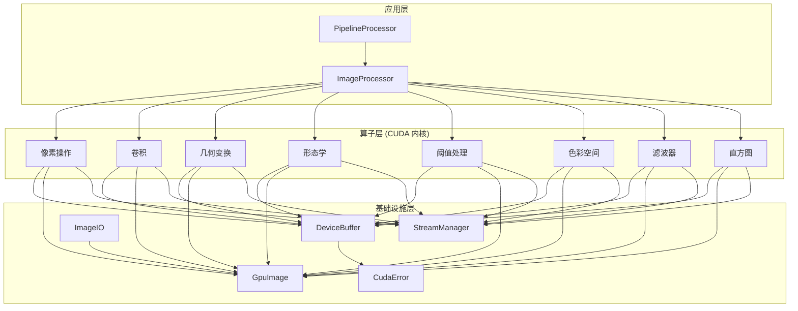
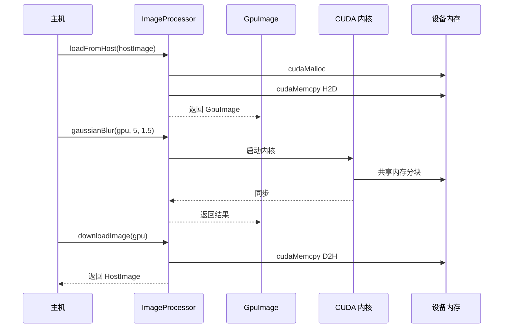
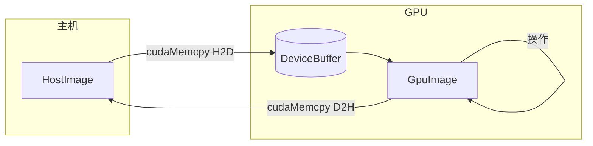

# 架构概览

Mini-OpenCV 采用**三层架构**设计，追求性能、模块化和易用性。

## 三层设计

## 层级职责

### 1. 应用层

用户交互的顶层 API：

| 组件 | 用途 |
|------|------|
| `ImageProcessor` | 图像操作的主入口 |
| `PipelineProcessor` | 链式多操作异步执行 |

### 2. 算子层

实现图像处理算法的 CUDA 内核：

| 类别 | 操作 | CUDA 技术 |
|------|------|-----------|
| **像素** | 反转、灰度、亮度 | 逐像素并行 |
| **卷积** | 高斯模糊、Sobel、自定义核 | 共享内存分块 |
| **直方图** | 计算、均衡化 | 原子操作 + 归约 |
| **几何** | 缩放、旋转、翻转、仿射 | 双线性插值 |
| **形态学** | 腐蚀、膨胀、开闭运算 | 自定义结构元素 |
| **阈值** | 全局、自适应、Otsu | 直方图驱动 |
| **色彩空间** | RGB/HSV/YUV 转换 | 矩阵运算 |
| **滤波** | 中值、双边、锐化 | 边缘保持滤波 |

### 3. 基础设施层

GPU 计算的核心工具：

| 组件 | 用途 |
|------|------|
| `DeviceBuffer` | RAII GPU 内存管理 |
| `GpuImage` | 带 GPU 内存的图像容器 |
| `CudaError` | 错误处理和检查 |
| `ImageIO` | 图像文件 I/O (JPEG, PNG, BMP) |
| `StreamManager` | 异步执行的 CUDA 流池 |

## 数据流

## 内存模型

### 零拷贝优化

关键优化：

1. **延迟分配**: 首次使用时分配内存
2. **缓冲区复用**: 临时缓冲区的内存池
3. **异步传输**: 使用 CUDA 流重叠计算和传输

## CUDA 流水线

多流执行实现操作重叠：

```mermaid
gantt
    title 多流流水线执行
    dateFormat X
    axisFormat %s
    
    section 流 0
    H2D 传输 0    :0, 2
    内核 0        :2, 5
    D2H 传输 0    :5, 7
    
    section 流 1
    H2D 传输 1    :1, 3
    内核 1        :3, 6
    D2H 传输 1    :6, 8
    
    section 流 2
    H2D 传输 2    :2, 4
    内核 2        :4, 7
    D2H 传输 2    :7, 9
```

## 支持的 GPU 架构

| 架构 | 计算能力 | 示例 GPU |
|------|---------|----------|
| Turing | SM 75 | RTX 20 系列, T4 |
| Ampere | SM 80/86 | A100, RTX 30 系列 |
| Ada Lovelace | SM 89 | RTX 40 系列, L4 |
| Hopper | SM 90 | H100 |

## 下一步

- [内存模型](./memory-model) - 深入了解 GPU 内存管理
- [CUDA 流](./cuda-streams) - 异步执行详情
- [设计决策](./design-decisions) - 架构决策记录