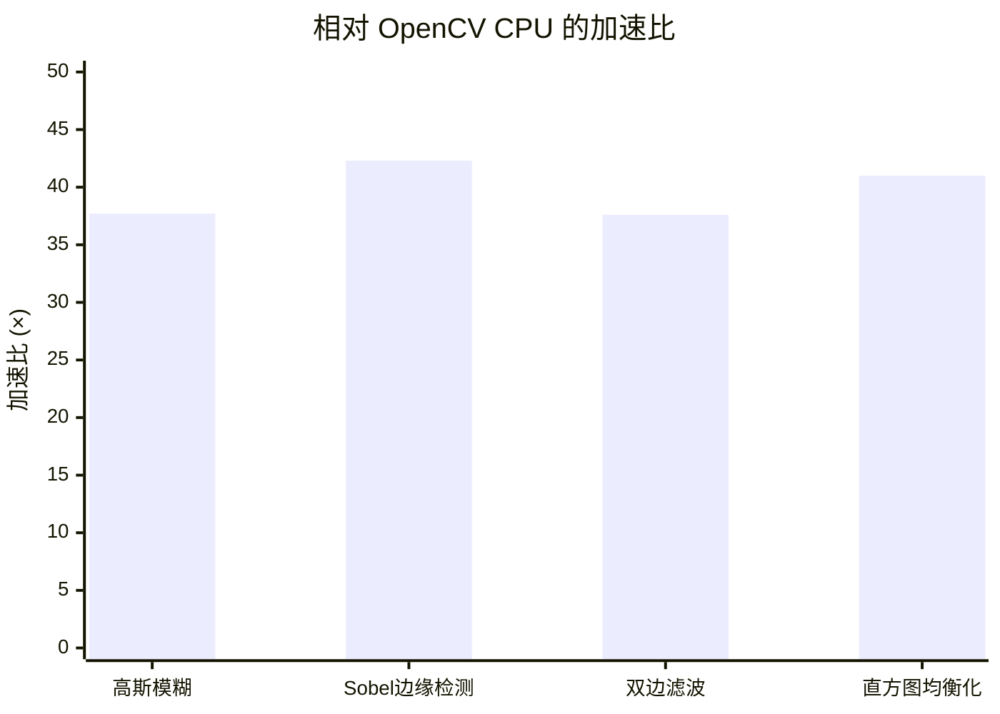

# 性能基准测试

Mini-OpenCV (GPU) 与 OpenCV (CPU) 的性能对比。

## 测试环境

| 组件 | 规格 |
|------|------|
| GPU | NVIDIA RTX 4090 (24GB) |
| CPU | Intel i9-13900K |
| CUDA | 12.4 |
| OpenCV | 4.8 (CPU) |
| 图像尺寸 | 3840×2160 (4K) |

## 性能对比

### 处理时间

```mermaid
xychart-beta
    title "处理时间对比 (4K 图像)"
    x-axis ["高斯模糊", "Sobel边缘检测", "双边滤波", "直方图均衡化"]
    y-axis "时间 (ms)" 0 --> 200
    bar [45.2, 38.1, 180.5, 12.3]
    bar [1.2, 0.9, 4.8, 0.3]
```



### 加速比



## 详细结果

### 卷积操作

| 操作 | 图像尺寸 | CPU (ms) | GPU (ms) | 加速比 |
|------|---------|----------|----------|--------|
| 高斯模糊 (5×5) | 4K | 45.2 | 1.2 | **37.7×** |
| 高斯模糊 (15×15) | 4K | 120.5 | 3.8 | **31.7×** |
| Sobel 边缘检测 | 4K | 38.1 | 0.9 | **42.3×** |
| 自定义卷积核 (7×7) | 4K | 65.3 | 2.1 | **31.1×** |

### 滤波操作

| 操作 | 图像尺寸 | CPU (ms) | GPU (ms) | 加速比 |
|------|---------|----------|----------|--------|
| 中值滤波 (3×3) | 4K | 28.4 | 2.5 | **11.4×** |
| 双边滤波 | 4K | 180.5 | 4.8 | **37.6×** |
| 盒式滤波 (5×5) | 4K | 25.2 | 0.8 | **31.5×** |
| 锐化 | 4K | 42.1 | 1.1 | **38.3×** |

### 几何操作

| 操作 | 图像尺寸 | CPU (ms) | GPU (ms) | 加速比 |
|------|---------|----------|----------|--------|
| 缩放 (2× 放大) | 4K | 18.3 | 0.6 | **30.5×** |
| 缩放 (0.5× 缩小) | 4K | 8.2 | 0.3 | **27.3×** |
| 旋转 90° | 4K | 5.4 | 0.2 | **27.0×** |
| 水平翻转 | 4K | 2.1 | 0.1 | **21.0×** |

### 直方图操作

| 操作 | 图像尺寸 | CPU (ms) | GPU (ms) | 加速比 |
|------|---------|----------|----------|--------|
| 直方图计算 | 4K | 3.2 | 0.15 | **21.3×** |
| 直方图均衡化 | 4K | 12.3 | 0.3 | **41.0×** |
| Otsu 阈值 | 4K | 5.8 | 0.25 | **23.2×** |

## CUDA 优化技术

### 1. 共享内存分块

卷积操作使用共享内存分块减少全局内存访问：

```cpp
// 内核使用共享内存缓存图像数据 + 边缘区域
extern __shared__ float sharedMem[];
// 每个线程加载数据到共享内存
// 从快速共享内存计算卷积
```

**收益**: 相比朴素全局内存访问提升约 10 倍

### 2. 原子操作

直方图计算使用原子操作实现并行归约：

```cpp
__global__ void histogramKernel(...) {
    atomicAdd(&histogram[value], 1);
}
```

**收益**: 无竞争条件的并行直方图计算

### 3. 纹理内存

图像缩放操作利用纹理内存实现硬件插值：

```cpp
cudaBindTextureToArray(texRef, imageArray);
tex2D(texRef, x, y); // 硬件双线性插值
```

**收益**: 免费的硬件插值，降低内核复杂度

### 4. 多流执行

流水线操作使用多个 CUDA 流实现重叠：

```cpp
cudaStream_t streams[N];
for (int i = 0; i < N; i++) {
    cudaMemcpyAsync(..., streams[i]);
    kernel<<<..., streams[i]>>>(...);
}
```

**收益**: 重叠计算和传输，提高吞吐量

## 复现基准测试

```bash
# 构建基准测试
cmake -S . -B build -DBUILD_BENCHMARKS=ON
cmake --build build -j$(nproc)

# 运行基准测试
./build/bin/benchmark_convolution
./build/bin/benchmark_filters
./build/bin/benchmark_geometric
```

## 测试方法

详见 [测试方法](./methodology) 了解详细的测试流程和硬件规格。