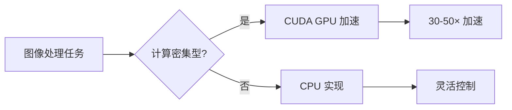
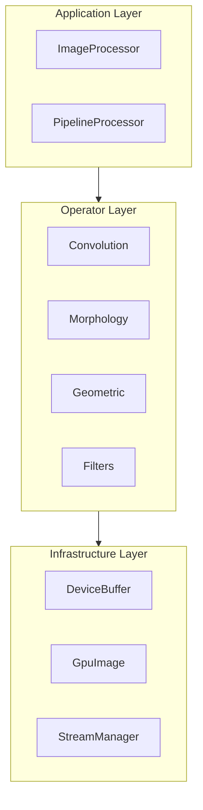

# 技术白皮书

本文档详细介绍 Mini-OpenCV 的设计理念、技术选型和优化策略。

## 项目背景

Mini-OpenCV 是一个 CUDA 高性能图像处理库，旨在提供比 CPU OpenCV 实现 **30-50 倍** 的性能加速。项目的设计目标：

1. **极致性能** - 充分利用 GPU 并行计算能力
2. **简洁 API** - C++17 现代化接口设计
3. **易于集成** - 可作为性能关键路径的即插即用替代方案
4. **完整测试** - 单元测试和性能基准测试覆盖

## 技术选型

### 核心技术栈

| 组件 | 版本 | 选型理由 |
|------|------|----------|
| C++ | 17 | 现代 C++ 特性：结构化绑定、std::optional、if constexpr |
| CUDA | 14+ | 最新 CUDA 特性：协作组、异步内存操作 |
| CMake | 3.18+ | 现代 CMake：FetchContent、目标导向构建 |
| GoogleTest | 1.14.0 | 业界标准测试框架 |
| Google Benchmark | 1.8.3 | 性能基准测试 |

### 为什么选择 CUDA？

CUDA 提供了：
- **大规模并行** - 数千个线程同时执行
- **内存层次** - Global/Shared/Registers 三级内存
- **专用硬件** - Tensor Core、纹理内存单元

## 架构设计

### 三层架构

### 设计原则

1. **职责分离**
   - Application Layer：用户 API、工作流编排
   - Operator Layer：CUDA 内核、算子实现
   - Infrastructure Layer：内存管理、错误处理

2. **零开销抽象**
   - 编译期多态（模板）
   - 内联关键路径
   - 避免虚函数调用

3. **资源管理**
   - RAII 内存管理
   - 内存池复用
   - 流水线异步执行

## 性能优化策略

### CUDA 内核优化

| 技术 | 描述 | 收益 |
|------|------|------|
| Shared Memory Tiling | 数据复用，减少全局内存访问 | 2-4× 加速 |
| Coalesced Access | 合并全局内存访问 | 1.5-2× 加速 |
| Warp Primitives | 使用 `__shfl`、`__reduce` | 1.2-1.5× 加速 |
| Atomic Operations | 原子计数，避免同步 | 1.1-1.3× 加速 |
| Loop Unrolling | 展开关键循环 | 1.1-1.2× 加速 |

### 内存优化

1. **零拷贝优化**
   - 使用 Pinned Memory
   - DMA 直接传输
   - 避免中间缓冲

2. **内存池复用**
   - 预分配大块内存
   - 减少分配开销
   - 碎片最小化

### 异步执行

```mermaid
gantt
    title CUDA Streams 并行执行
    dateFormat X
    axisFormat %s
    
    section Stream 0
    Upload Image 1    :0, 1
    Gaussian Blur     :1, 2
    Download Result 1 :2, 3
    
    section Stream 1
    Upload Image 2    :0, 1
    Sobel Edge        :1, 2
    Download Result 2 :2, 3
```

## 与同类项目对比

| 特性 | Mini-OpenCV | OpenCV CUDA | cv-cuda | NPP |
|------|:-----------:|:-----------:|:-------:|:---:|
| 现代 C++ API | ✅ | ❌ | ✅ | ❌ |
| 内存管理 | RAII | 手动 | RAII | 手动 |
| 异步执行 | ✅ | 部分 | ✅ | ✅ |
| 完整测试 | ✅ | ❌ | ✅ | ❌ |
| 开源 | ✅ | ✅ | ✅ | 部分 |
| 学习曲线 | 低 | 中 | 中 | 高 |

## 未来规划

1. **Tensor Core 支持** - 利用 Tensor Core 加速卷积
2. **多 GPU 支持** - 跨 GPU 负载均衡
3. **Python 绑定** - 提供 Python API
4. **更多算子** - 扩展算子覆盖范围

## 参考资料

详见 [学术引用](../references/) 页面。
